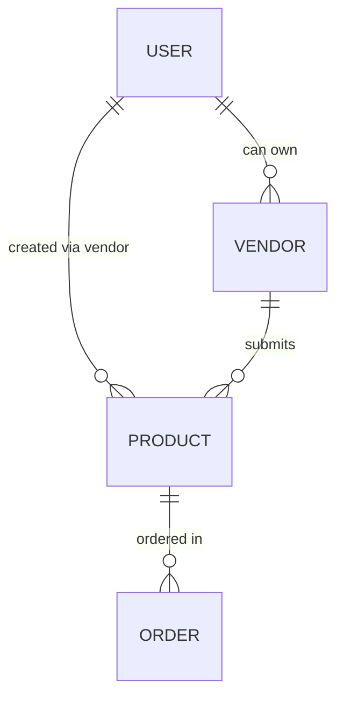

# 🛒 Online Marketplace for HCMUT (Backend)

> Node.js + Express + MongoDB API
> Role-based vendor & product management with approval workflow (Staff/Admin).

---

## 📁 Folder Structure

```
backend/
├── models/
│   ├── User.js
│   ├── Vendor.js
│   ├── Product.js
│   ├── Category.js
│   ├── Notification.js
│   ├── AuditLog.js
│   └── Order.js
├── routes/
│   └── api/
│       ├── users.js
│       ├── vendors.js        # ✅ Vendor registration & approval
│       ├── products.js       # ✅ Product CRUD & approval
│       └── auth.js
├── middlewares/
│   └── authMiddleware.js
├── server.js
└── .env
```

---

## ⚙️ Installation & Setup

1. **Clone repository**

   ```bash
   git clone https://github.com/<your-repo>.git
   cd backend
   ```

2. **Install dependencies**

   ```bash
   npm install
   ```

3. **Set up environment variables**

   Create a `.env` file in `/backend`:

   ```env
   PORT=5050
   SECRET_KEY="YOUR_SECRET_KEY"
   MONGODB_URI="mongodb+srv://<username>:<password>@<cluster>.mongodb.net/QLDAPM"
   ```

4. **Run server (dev mode)**

   ```bash
   npm run server
   ```

   > Uses **nodemon** for live reload.

---

## 🧩 Features Overview

### 🧍 User Roles

| Role       | Description                                |
| ---------- | ------------------------------------------ |
| `CUSTOMER` | Default after registration                 |
| `VENDOR`   | Assigned after staff approval              |
| `STAFF`    | Can approve vendors & products             |
| `ADMIN`    | Same permissions as staff, plus management |

---

## 🏪 Vendor Module (`routes/api/vendors.js`)

### 1️⃣ Register as Vendor

**Endpoint:** `POST /api/vendor/register`
**Auth:** `CUSTOMER` token required

```json
{
  "business_name": "Tech Store",
  "description": "Chuyên bán thiết bị điện tử"
}
```

✅ Creates new vendor with:

```js
approvalStatus = "PENDING"
```

---

### 2️⃣ Approve Vendor (Staff/Admin)

**Endpoint:** `POST /api/vendor/:id/approve`
**Auth:** `STAFF` or `ADMIN`

* Updates vendor to `APPROVED`
* Auto-updates user:

  ```js
  role = "VENDOR"
  vendorProfile = vendor._id
  ```

---

### 3️⃣ Reject Vendor

**Endpoint:** `POST /api/vendor/:id/reject`
**Auth:** `STAFF` or `ADMIN`

```json
{ "reason": "Thông tin kinh doanh không hợp lệ" }
```

* Sets `approvalStatus = "REJECTED"`
* Keeps user role as `CUSTOMER`

---

## 📦 Product Module (`routes/api/products.js`)

### 1️⃣ Create Product (Vendor Only)

**Endpoint:** `POST /api/products`
**Auth:** `VENDOR`

```json
{
  "category": "<category_id>",
  "name": "Bluetooth Speaker",
  "description": "Loa pin 10 tiếng",
  "price": 499000,
  "stock": 30,
  "images": [{ "url": "https://example.com/img.jpg" }]
}
```

✅ Product created as:

```js
approvalStatus = "PENDING"
```

---

### 2️⃣ Update Product

**Endpoint:** `PUT /api/products/:id`
**Auth:** `VENDOR`

> Only the product owner can edit.

* Edits fields like `price`, `stock`, etc.
* Automatically resets `approvalStatus = "PENDING"`

---

### 3️⃣ Delete Product

**Endpoint:** `DELETE /api/products/:id`
**Auth:** `VENDOR`

---

### 4️⃣ Get Approved Products

**Endpoint:** `GET /api/products`
**Auth:** Public

Supports:

```
?keyword=speaker&category=<id>&sortBy=newest&page=1&limit=12
```

---

### 5️⃣ Staff Approval Workflow

| Action                | Endpoint                         | Auth        | Result                                      |
| --------------------- | -------------------------------- | ----------- | ------------------------------------------- |
| View pending products | `GET /api/products-pending`      | STAFF/ADMIN | Lists all PENDING                           |
| Approve product       | `POST /api/products/:id/approve` | STAFF/ADMIN | `approvalStatus = APPROVED`                 |
| Reject product        | `POST /api/products/:id/reject`  | STAFF/ADMIN | `approvalStatus = REJECTED`, saves `reason` |

---

## 🔑 Auth Middleware

Located at `middlewares/authMiddleware.js`

```js
const jwt = require('jsonwebtoken');
const User = require('../models/User');

module.exports = async function (req, res, next) {
  const authHeader = req.headers.authorization;
  if (!authHeader) return res.status(401).json({ success: false });

  const [scheme, token] = authHeader.split(' ');
  if (scheme?.toLowerCase() !== 'bearer' || !token)
    return res.status(401).json({ error: 'Only accept Bearer token' });

  try {
    const payload = jwt.verify(token, process.env.SECRET_KEY);
    const user = await User.findById(payload.id).select('_id role vendorProfile email');
    if (!user) return res.status(401).json({ error: 'User not found' });

    req.user = {
      id: user._id.toString(),
      role: user.role,
      vendorProfile: user.vendorProfile,
      email: user.email
    };
    next();
  } catch (err) {
    return res.status(401).json({ error: 'Invalid token' });
  }
};
```

✅ Reads fresh role from DB → user gets correct role immediately after vendor approval.

---

## 🧪 API Testing with Bruno / Postman

### 🔧 Environment Variables

| Variable         | Description                 |
| ---------------- | --------------------------- |
| `BASE_URL`       | `http://localhost:5050/api` |
| `CUSTOMER_TOKEN` | JWT for Customer            |
| `STAFF_TOKEN`    | JWT for Staff               |
| `VENDOR_TOKEN`   | JWT for Vendor              |

---

### 🔄 Full Test Flow

| Step | Actor    | Endpoint                | Description                    |
| ---- | -------- | ----------------------- | ------------------------------ |
| 1    | Customer | `/vendor/register`      | Submit vendor info (PENDING)   |
| 2    | Staff    | `/vendor/:id/approve`   | Approve vendor (user → VENDOR) |
| 3    | Vendor   | `/products`             | Create product (PENDING)       |
| 4    | Staff    | `/products/:id/approve` | Approve product                |
| 5    | Public   | `/products`             | Browse approved products       |

> Use Bruno tests or Postman collections to simulate this flow.

---

## 🧱 Database Design (simplified)



---


